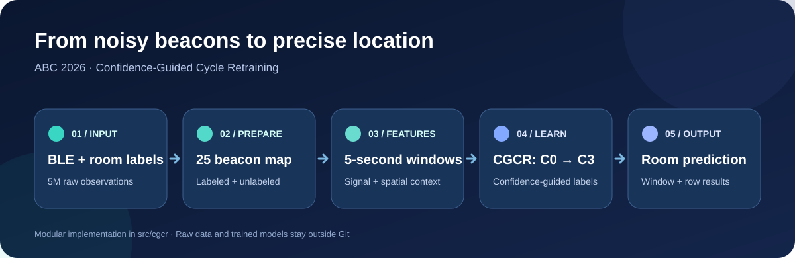
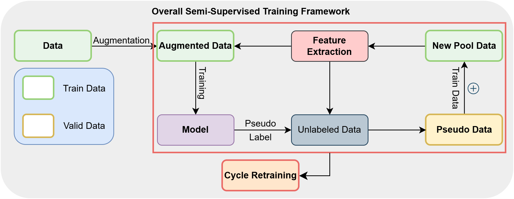
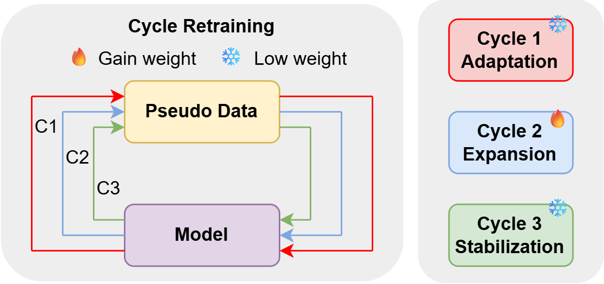
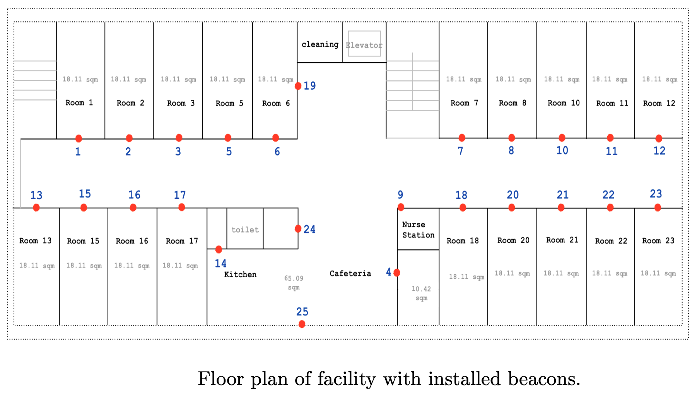
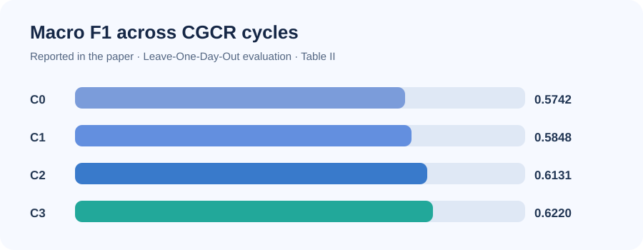

# ABC 2026: Nhận diện vị trí trong nhà bằng BLE



[English](README.md) · [Sơ đồ hệ thống](docs/architecture.md) · [Chuẩn dữ liệu](docs/data-contract.md)

Repo này chuyển các notebook nghiên cứu cũ thành package Python có thể chạy theo từng bước. Notebook gốc được giữ nguyên trong `notebooks/legacy/`; hai tutorial của ban tổ chức nằm trong `notebooks/organizer/`. Mã chạy chính nằm ở `src/cgcr/`.

Phương pháp CGCR trong paper kết hợp dữ liệu tăng cường, đặc trưng tín hiệu và không gian, cùng pseudo-label có ngưỡng tin cậy tăng dần để xử lý tín hiệu BLE thay đổi giữa các ngày. [Ghi chú nghiên cứu](docs/research.md) phân biệt kết quả paper với những gì repo hiện tại đã kiểm chứng.

## Phương pháp trong paper

Hai hình dưới đây do bạn cung cấp từ paper: hình đầu mô tả luồng dữ liệu tăng cường, trích xuất đặc trưng và pseudo-label; hình sau giải thích ba giai đoạn retraining. Chúng minh họa thiết kế nghiên cứu LODO. Lệnh `train` trong repo huấn luyện model cuối trên dữ liệu có nhãn và chưa có nhãn được cung cấp.





Ngưỡng tin cậy và trọng số chính xác của từng chu kỳ nằm trong [ghi chú nghiên cứu](docs/research.md), Bảng I.

## Bản đồ beacon và kết quả nghiên cứu

Số beacon trong `config/beacon_map.json` khớp với vị trí đánh số trên sơ đồ tầng 5 của ban tổ chức:



Biểu đồ dưới đây dùng số liệu **paper báo cáo**, được đánh giá theo Leave-One-Day-Out. Đây không phải kết quả đo lại từ code đã tái cấu trúc:



Macro F1 tăng từ **0,5742 ở C0** lên **0,6220 ở C3**; paper báo cáo accuracy C3 là **0,7091** và weighted F1 là **0,7166**.

## Chạy từ dữ liệu gốc

Cần Python 3.10+ và `uv`. Chạy tại thư mục gốc của repo:

```powershell
uv venv
uv pip install -e .
$archive = 'C:\path\to\ABC2026.zip'
uv run cgcr prepare --archive $archive --beacon-map config/beacon_map.json --output-dir data/prepared
uv run cgcr augment --wide data/prepared/labeled_wide.csv --output data/prepared/synthetic.csv
uv run cgcr train --labeled data/prepared/labeled_wide.csv --synthetic data/prepared/synthetic.csv --unlabeled data/prepared/unlabeled_wide.csv --model models/cgcr.joblib
```

Khi có file test riêng:

```powershell
uv run cgcr predict --model models/cgcr.joblib --test data/test_file.csv --output-dir outputs
```

ZIP được đọc trực tiếp, không cần giải nén. `config/beacon_map.json` chứa bảng MAC → beacon 1–25 đúng thứ tự trong tutorial của ban tổ chức. File test dùng trong notebook cuối không có trong ZIP.

## Đầu ra và giới hạn

`prepare` tạo `labeled_wide.csv`, `unlabeled_wide.csv` và `preprocessing_summary.json`. `augment` tạo dữ liệu bổ sung cho lớp hiếm. `train` lưu model cùng thứ tự đặc trưng, nhãn và room signatures. `predict` xuất dự đoán theo cửa sổ và theo từng dòng test. Các file dữ liệu, model và đầu ra không được đưa vào Git.

Notebook tiền xử lý cũ vẫn thất lạc. Bước ghép dữ liệu gốc hiện tại là bản dựng lại có quy tắc rõ ràng: RSSI mạnh nhất trong mỗi giây, chỉ gán nhãn cho giây nằm trọn trong một khoảng nhãn không xung đột. Vì vậy không nên coi các số liệu của paper là kết quả đã được tái lập từ repo này. Chi tiết nằm trong [chuẩn dữ liệu](docs/data-contract.md) và [ghi chú chuyển đổi](docs/migration.md).
