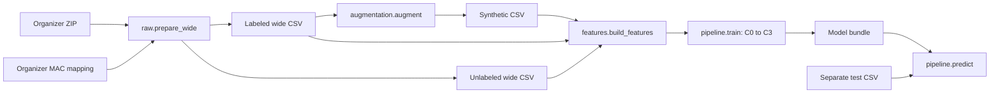

# Architecture

| Module | Responsibility | Key invariant |
| --- | --- | --- |
| `raw` | Stream organizer ZIP, filter users/time, map MACs, join labels | Physical beacon IDs come from `config/beacon_map.json`; uncertain label seconds stay unlabeled. |
| `data` | Validate and load wide CSVs | `timestamp` is parseable; RSSI columns are numeric; absent beacons are zero. |
| `augmentation` | Select scarce room segments and synthesize BLE blocks | Seed rows come from the fold's training days. |
| `features` | Shared labeled and unlabeled feature extraction | Same feature schema and ordering at train and inference time. |
| `pipeline` | C0–C3 training, bundle persistence, prediction | Bundle stores label encoder, signatures, RSSI columns and feature order. |
| `cli` | File paths and command dispatch | No Colab or Kaggle paths in library code. |

`data/`, `models/` and `outputs/` are generated locally and ignored by Git. `notebooks/legacy/` and `notebooks/organizer/` are source records; package modules are the maintained implementation.
